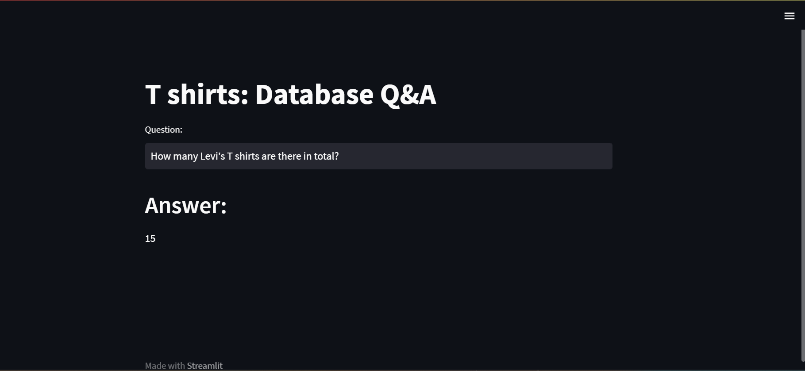

# T-shirt-store---An-LLM-project
T-shirt store is a data retrieval project where the user can retrieve data  from the t-shirt database by just passing a simple question like query. It uses LLM technology.

